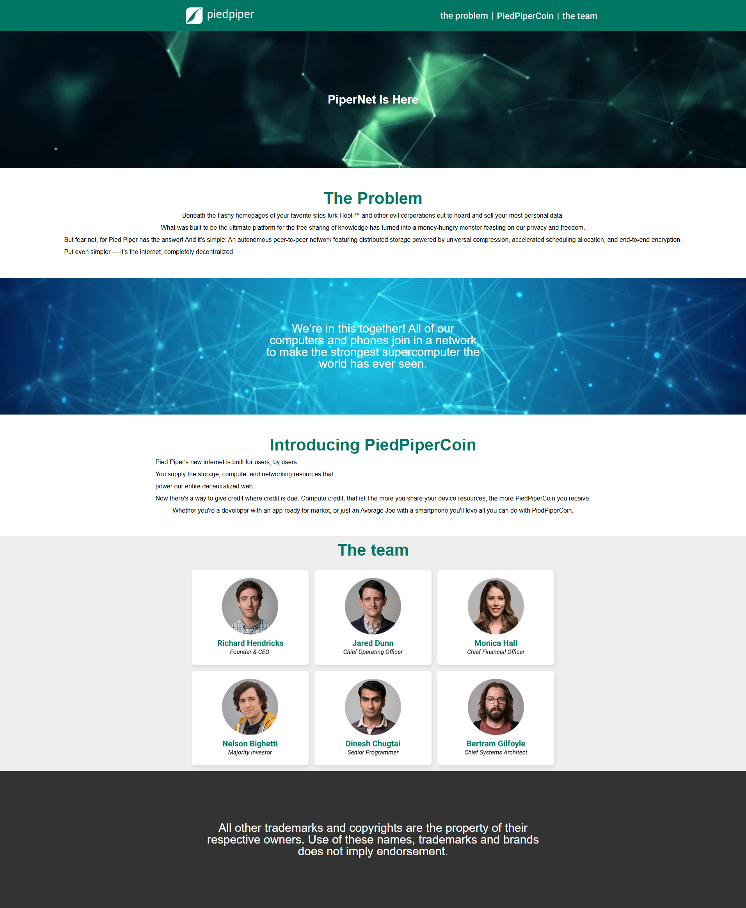

# 🎨 Верстка адаптивных макетов из Figma

Этот проект включает верстку **2 макетов**, созданных в Figma.  
Макеты адаптивны и выполнены с использованием современных технологий (HTML, CSS, SCSS).  

---

## 🚀 Используемый стек

  

---

## 🖼️ Превью макета

  Ccылка - https://shamitsu212.github.io/Adaptive_layout1/

 

---
